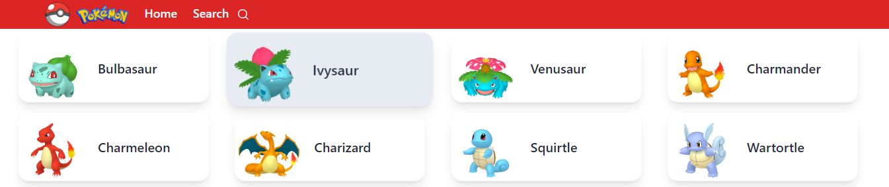

# Find Pokemon App

Welcome to the Find Pokémon App! This React.js web application allows users to search for Pokémon by name or ID and retrieve detailed information about them.



## Technologies Used

- React.js
- Vite for fast development and optimized builds
- Axios for fetching data from the [PokeAPI](https://pokeapi.co/)
- React Router for routing
- Tailwind CSS for styling

## Installation

```
npm install
```

## Dev

```
npm run dev
```

## Build

```
npm run build
```

## Features

- Search for Pokémon by name or ID.
- View detailed information about each Pokemon, including their types, abilities, moves, height, weight, and experience.

## API Usage

This app utilizes the [PokeAPI](https://pokeapi.co/) to fetch Pokémon data. The PokéAPI is a comprehensive database of Pokémon information, including their types, abilities, moves, and more.

## Acknowledgements

- [PokeAPI](https://pokeapi.co/) - Thank you for providing the Pokémon data API..
- [Tailwind CSS](https://tailwindcss.com/) - A utility-first CSS framework for quickly building custom designs.
- [React Router](https://reactrouter.com/) - Declarative routing for React applications.
- [Vite](https://vitejs.dev/) - Next Generation Frontend Tooling
